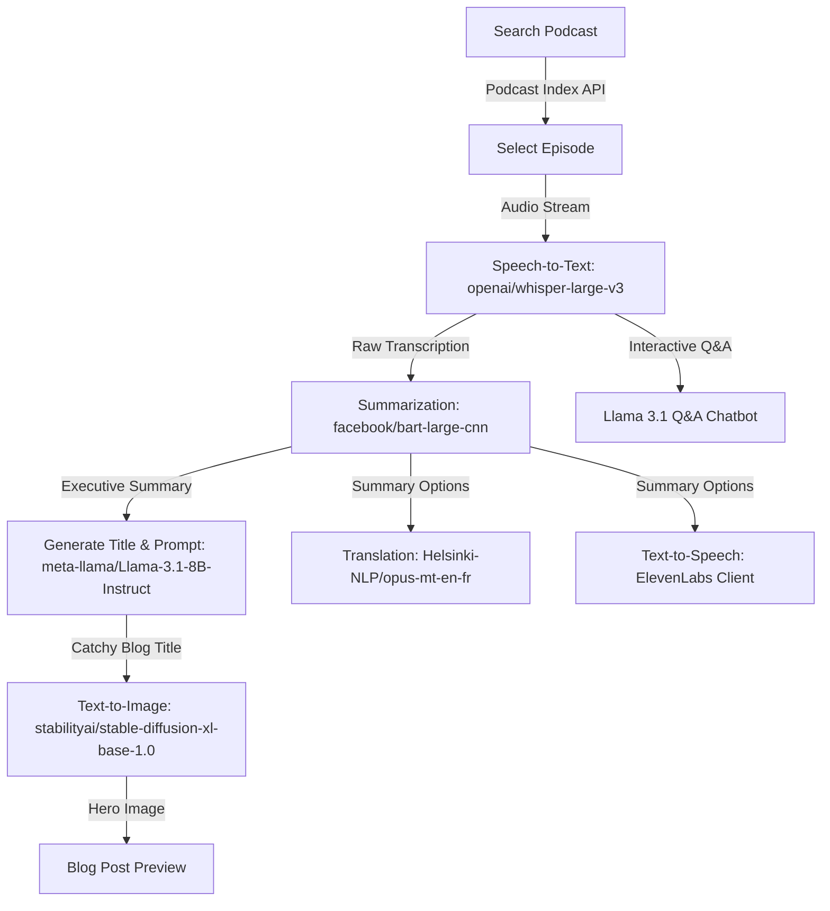

# Blogcaster - AI-Powered Podcast to Blog SaaS App

[]()
[](mailto:ilya.devder@extrawest.com)
[]()
[](https://opensource.org/licenses/MIT)


## 📖 About

**Blogcaster** is an AI-powered podcast discovery and content generation platform built with Next.js 16, React 19, and Tailwind CSS. The application leverages Hugging Face Inference API and ElevenLabs to automatically transcribe podcast episodes, generate catchy SEO-friendly blog posts, produce stunning AI-generated hero images, translate summaries, generate audio voiceovers, and allow users to chat with the podcast content.

### 🏷️ Topics & Tags


---

## 🎙️ Core Workflow & Pipeline

Here is how Blogcaster processes podcast audio into complete blog experiences:



## Key Features

- **Semantic Podcast Discovery**: Instant podcast search powered by the Podcast Index API.
- **AI Speech-to-Text Pipeline**: High-accuracy automatic speech recognition using `openai/whisper-large-v3`.
- **Automated Summarization & SEO**: Generates executive summaries using `facebook/bart-large-cnn` and crafts catchy titles with `meta-llama/Llama-3.1-8B-Instruct`.
- **Text-to-Image Hero Generation**: Automatically designs custom, high-quality blog hero graphics using `stabilityai/stable-diffusion-xl-base-1.0`.
- **Multi-lingual Translation**: Seamlessly translates generated blog summaries from English to French using `Helsinki-NLP/opus-mt-en-fr`.
- **High-Fidelity Text-to-Speech**: Generates natural, lifelike audio voiceovers of summaries via ElevenLabs.
- **Interactive Podcast Q&A Chatbot**: A custom LLM assistant allowing users to ask questions and get instant answers anchored to the podcast transcript context.

## Tech Stack

- **Framework**: Next.js 16 & React 19
- **Styling**: Tailwind CSS & DaisyUI
- **Speech Recognition**: Whisper Large v3 (`openai/whisper-large-v3` via Hugging Face)
- **Language Models**: Llama 3.1 8B Instruct & BART Large CNN (`meta-llama/Llama-3.1-8B-Instruct`, `facebook/bart-large-cnn` via Hugging Face)
- **Image Generation**: Stable Diffusion XL (`stabilityai/stable-diffusion-xl-base-1.0` via Hugging Face)
- **Translation**: OPUS MT (`Helsinki-NLP/opus-mt-en-fr` via Hugging Face)
- **Audio Synthesis**: ElevenLabs (`elevenlabs-js`)
- **Podcast Database**: Podcast Index API (`podcastdx-client`)

## Video demonstration

https://github.com/user-attachments/assets/b0196089-a558-4001-bafe-e53be529d851

## Running On Local Machine

### 1. Configure Environment Variables

Create a `.env` file in the root directory and add the following API credentials:

```bash
PODCAST_INDEX_API_KEY="your_podcast_index_key"
PODCAST_INDEX_API_SECRET="your_podcast_index_secret"
HF_TOKEN="your_hugging_face_token"
ELEVENLABS_API_KEY="your_elevenlabs_api_key"
ELEVENLABS_VOICE_ID="optional_voice_id"
```

### 2. Install Dependencies

Using Bun (recommended):

```bash
bun install
```

Or using npm:

```bash
npm install
```

### 3. Launch Development Server

Using Bun:

```bash
bun dev
```

Or using npm:

```bash
npm run dev
```

Open [http://localhost:3000](http://localhost:3000) in your browser to view the application.

## Branches

- `main`

## Contributing

Feel free to open issues or submit pull requests to improve the project. Contributions are welcome!

---

Developed by [extrawest](https://extrawest.com/). Software development company
